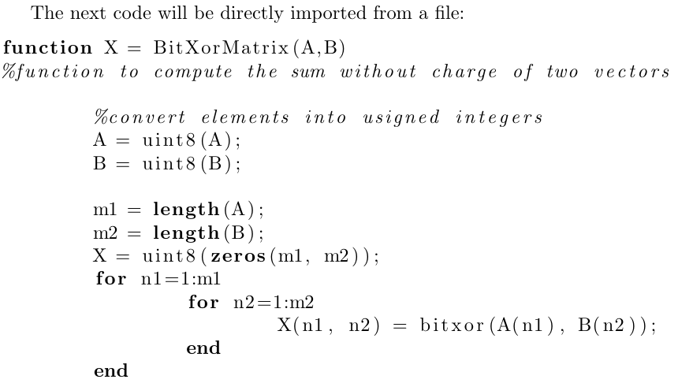

# 在$\LaTeX$中添加代码块

**package:** \usagepackage{listings}

## 两种方法来添加代码块

### 1.直接添加代码块
```LaTeX{.line-numbers}
\begin{lstlisting}[language=]
你想显示的代码
\end{lstlisting}
```

在这个代码中,参数**language**决定了添加的代码块的语言,会将其进行"语法高亮处理"

这里可以查看$\LaTeX$支持对哪些语言进行高亮处理:[Reference Guide](https://www.overleaf.com/learn/latex/Code_listing#Reference_guide)

### 2.从已有的源代码中导入

```LaTeX{.line-numbers}
\lstinputlisting[language=, firstline=, lastline=]{source code}
```

这里,将将source code中的第firstline行到lastline行,如果这两个参数缺省,则导入整个文件.

## 设置显示的代码格式

这里引用一个示例

<center>
Figure from Overleaf.com
</center>


可以看见,$\LaTeX$的语法高亮只是将其关键字进行加粗,为了让其更好看,我们在导言区添加如下代码:

```LaTex{.line-numbers}
\usepackage{xcolor}

\definecolor{codegreen}{rgb}{0,0.6,0}
\definecolor{codegray}{rgb}{0.5,0.5,0.5}
\definecolor{codepurple}{rgb}{0.58,0,0.82}
\definecolor{backcolour}{rgb}{0.95,0.95,0.92}

\lstdefinestyle{mystyle}{
    backgroundcolor=\color{backcolour},   
    commentstyle=\color{codegreen},
    keywordstyle=\color{magenta},
    numberstyle=\tiny\color{codegray},
    stringstyle=\color{codepurple},
    basicstyle=\ttfamily\footnotesize,
    breakatwhitespace=false,         
    breaklines=true,                 
    captionpos=b,                    
    keepspaces=true,                 
    numbers=left,                    
    numbersep=5pt,                  
    showspaces=false,                
    showstringspaces=false,
    showtabs=false,                  
    tabsize=2
}

\lstset{style=mystyle}
```

**其中:**
- 第*1-6*行代码用来定义代码块中可能用到的颜色.
- 第*8-25*行代码:\lstdefinestyle用来自定义一个代码块的格式,可自行修改.
- 第*27*行:\lstset{style=mystyle}将代码块的格式设置成刚刚自己定义的.

## 设置代码块的标题
有时候,需要给代码块取一个标题,可以用如下语句:
```latex{.line-numbers}
\begin{lstlisting}[language=,caption=]
你想显示的代码
\end{lstlisting}

or use

\lstinputlisting[language=Octave, firstline=, lastline=,caption=]{source}
```

即在添加代码块的参数中,添加**caption**.

## 在目录中添加代码列表
在导言区添加`\renewcommand{\lstlistoflistings}{code}`[^1]

在生成目录的后面添加`\lstlistoflistings`


[^1]:可以把code修改成其它想要显示的名字


## 代码块样式表

### 1.fromoverleaf
```latex{.line-numbers}
\usepackage{xcolor}

\definecolor{codegreen}{rgb}{0,0.6,0}
\definecolor{codegray}{rgb}{0.5,0.5,0.5}
\definecolor{codepurple}{rgb}{0.58,0,0.82}
\definecolor{backcolour}{rgb}{0.95,0.95,0.92}

\lstdefinestyle{mystyle}{
    backgroundcolor=\color{backcolour},   
    commentstyle=\color{codegreen},
    keywordstyle=\color{magenta},
    numberstyle=\tiny\color{codegray},
    stringstyle=\color{codepurple},
    basicstyle=\ttfamily\footnotesize,
    breakatwhitespace=false,         
    breaklines=true,                 
    captionpos=b,                    
    keepspaces=true,                 
    numbers=left,                    
    numbersep=5pt,                  
    showspaces=false,                
    showstringspaces=false,
    showtabs=false,                  
    tabsize=2
}

\lstset{style=mystyle}
```

### 2.
```latex{.line-numbers}
\lstdefinestyle{mystyle}{
    basicstyle=\ttfamily\small,
    aboveskip={1.0\baselineskip},
    belowskip={1.0\baselineskip},
    columns=fixed,
    extendedchars=true,
    breaklines=true,
    tabsize=4,
    prebreak=\raisebox{0ex}[0ex][0ex]{\ensuremath{\hookleftarrow}},
    frame=lines,
    showtabs=false,
    showspaces=false,
    showstringspaces=false,
    keywordstyle=\color[rgb]{0.627,0.126,0.941},
    commentstyle=\color[rgb]{0.133,0.545,0.133},
    stringstyle=\color[rgb]{01,0,0},
    numbers=left,
    numberstyle=\small,
    stepnumber=1,
    numbersep=10pt,
    captionpos=t,
    escapeinside={\%*}{*)}
    }
\lstset{style=mystyle}
```
